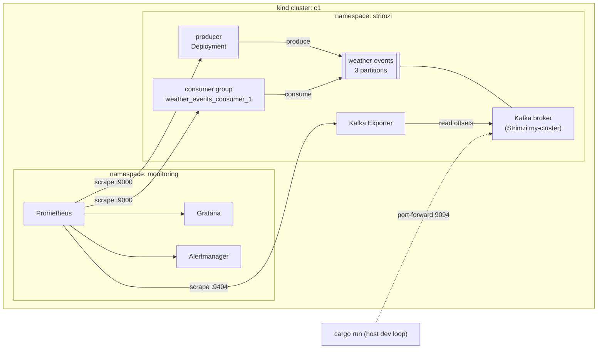
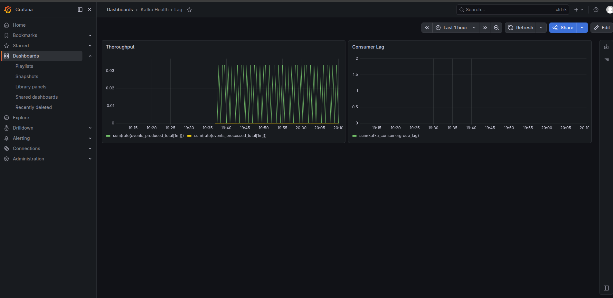
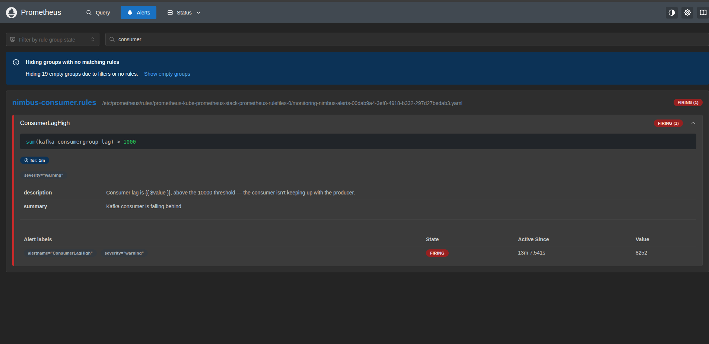
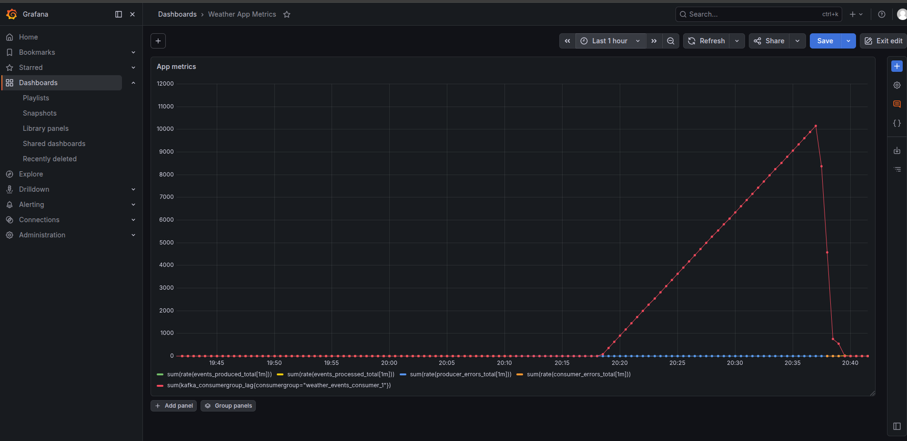
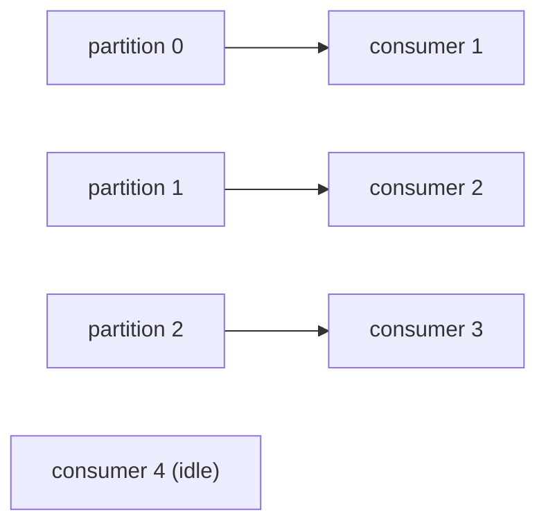

# NimbusData

A weather-telemetry streaming pipeline for learning distributed systems. A Rust producer simulates sensor readings and publishes them to Kafka while a Rust consumer reads them back. It runs on Kubernetes (Kafka via the Strimzi operator on a local `kind` cluster), with Prometheus and Grafana for metrics, dashboards, and lag alerting.

## What it covers

- Event streaming through Kafka with a keyed, partitioned topic
- Consumer groups and partition-based horizontal scaling
- Two Rust services (producer, consumer) built and deployed as container images
- Kubernetes deployment of Kafka via Strimzi
- Application metrics instrumented in Rust and scraped by Prometheus
- Consumer-lag monitoring and a firing alert on backpressure

## Architecture



The producer and consumer reach Kafka two ways:

- **In-cluster** (Deployments): the internal `plain` listener, `my-cluster-kafka-bootstrap.strimzi.svc:9092`. No tunnel needed.
- **Host dev loop** (`cargo run`): the external `nodeport` listener over `kubectl port-forward` to `localhost:9094`.

## Tech stack

| Area | Tools |
|------|-------|
| Services | Rust, rdkafka, tokio, serde, `metrics` + `metrics-exporter-prometheus` |
| Streaming | Apache Kafka, Strimzi operator |
| Cluster | kind, kubectl, Helm |
| Monitoring | kube-prometheus-stack (Prometheus, Grafana, Alertmanager), Kafka Exporter |

## Repository layout

```
producer/          Rust producer crate (generates and publishes weather events)
consumer/          Rust consumer crate (reads and prints events, tracks throughput)
Dockerfile         Multi-stage build. One builder, two runtime targets
kafka/
  kafka-cluster.yaml   Kafka CR, node pool, KafkaTopic, Kafka Exporter
k8s/
  kind-config.yaml     Two-node kind cluster
  producer-deployment.yaml
  consumer-deployment.yaml
  monitoring/
    producer-podmonitor.yaml
    consumer-podmonitor.yaml
    kafka-exporter-podmonitor.yaml
    alerts.yaml            ConsumerLagHigh PrometheusRule
screenshots/       Dashboard and alert captures
```

## Prerequisites

- Docker, `kind`, `kubectl`, `helm`
- Rust toolchain, plus `build-essential`, `cmake`, `pkg-config` (rdkafka compiles librdkafka from C source)

## Setup

```bash
# 1. Cluster
kind create cluster --config k8s/kind-config.yaml --name c1

# 2. Strimzi operator + Kafka cluster (topic, exporter included)
helm install strimzi-kafka-operator strimzi/strimzi-kafka-operator -n strimzi --create-namespace
kubectl apply -f kafka/kafka-cluster.yaml

# 3. Monitoring stack
helm install kube-prometheus-stack prometheus-community/kube-prometheus-stack -n monitoring --create-namespace

# 4. Build images and load them into kind (no registry needed)
docker build --target producer -t producer:dev .
docker build --target consumer -t consumer:dev .
kind load docker-image producer:dev consumer:dev --name c1

# 5. Deploy workloads + monitors + alert
kubectl apply -f k8s/producer-deployment.yaml -f k8s/consumer-deployment.yaml
kubectl apply -f k8s/monitoring/
```

## Running

The Deployments connect to the internal listener with no extra setup. For the host dev loop:

```bash
# tunnel to Kafka, then run either service locally
kubectl port-forward -n strimzi svc/my-cluster-dual-role-0 9094:9094
cargo run -p producer   # or -p consumer
```

Access the UIs:

```bash
kubectl port-forward -n monitoring svc/kube-prometheus-stack-prometheus 9090:9090   # Prometheus
kubectl port-forward -n monitoring svc/kube-prometheus-stack-grafana 3000:80        # Grafana (admin / secret below)
kubectl get secret -n monitoring kube-prometheus-stack-grafana -o jsonpath='{.data.admin-password}' | base64 -d
```

## Observability

Each service exposes Prometheus metrics on `0.0.0.0:9000/metrics`:

| Metric | Type | Source |
|--------|------|--------|
| `events_produced_total` | counter | producer |
| `producer_errors_total` | counter | producer |
| `events_processed_total` | counter | consumer |
| `consumer_errors_total` | counter | consumer |
| `kafka_consumergroup_lag` | gauge | Kafka Exporter |

Prometheus discovers the endpoints through `PodMonitor`. Per-second rates are derived in queries like `rate(events_produced_total[1m])`.



## Alerting

`ConsumerLagHigh` fires when total lag stays above the threshold for one minute:

```
expr: sum(kafka_consumergroup_lag) > 1000
for:  1m
```

To trigger it, stop the consumer so lag builds while the producer keeps writing:

```bash
kubectl scale deploy/consumer -n strimzi --replicas=0
# lag climbs past 1000, the alert goes Pending then Firing
kubectl scale deploy/consumer -n strimzi --replicas=1   # lag drains, alert resolves
```



The same run in Grafana:



## Scaling and partitions

The topic has 3 partitions. A consumer group assigns one partition per member, so consumer throughput scales with consumer count up to the partition limit.



Scaling the consumer Deployment to 3 gives each pod one partition. A fourth gets none and idles as a standby, since a partition is only assigned to one consumer at a time.

```bash
kubectl scale deploy/consumer -n strimzi --replicas=3
kubectl exec -n strimzi my-cluster-dual-role-0 -c kafka -- \
  bin/kafka-consumer-groups.sh --bootstrap-server localhost:9092 \
  --describe --group weather_events_consumer_1 --members
```

## Design notes

- **Dev vs prod connectivity.** A Kafka client uses the bootstrap address only for a metadata request, then connects to whatever address the broker *advertises*. Inside the cluster, that advertised address is internal Service DNS and works directly. For the host loop the external listener is set to advertise `localhost` so the port-forward tunnel is reachable.
- **Keyed messages.** Events are keyed by `station_id` across ten stations. Kafka routes `hash(key) % partitions`, so each station lands on a fixed partition. That spreads load across partitions while keeping per-station ordering.
- **One Dockerfile, two images.** A shared builder stage compiles the workspace once. Two runtime stages copy out the producer and consumer binaries, selected with `docker build --target`. The runtime image is `debian-slim` with only the binary and its shared libraries.
- **Counters, not gauges, for rates.** The app exposes monotonic counters and lets PromQL compute rates. Counters survive scrapes and restarts.

## Mistakes and Lessons Learned

- `MessageTimedOut` (partition `-1`, offset `-1001`) means the client is using an address it cannot reach: wrong port, a container's `localhost` instead of the host, or a Service DNS name missing the `.svc` label. After a broker pod restart, a long-lived producer can wedge on this and needs a `rollout restart` to reconnect.
- `PodMonitor` and `PrometheusRule` objects need the label `release: kube-prometheus-stack`, or the operator never discovers them.
- A `PodMonitor` with two `podMetricsEndpoints` entries scrapes the pod twice and double-counts. It should be one entry.
- The Kafka Exporter `topicRegex`/`groupRegex` are regular expressions. `*` is invalid and crashes the exporter. Use `.*`.
- A `KafkaTopic` without an explicit `namespace: strimzi` lands in the wrong namespace, where the topic operator ignores it.

## Results

- ~10 simulated stations (adjustable), keyed and partitioned across 3 partitions
- Up to 3 active consumer instances in one group, plus standby
- Consumer-lag monitoring and alerting through Prometheus and Alertmanager
- Kafka deployed on Kubernetes via Strimzi, with Grafana dashboards

## Future work

- Real event timestamps instead of a fixed placeholder
- TLS listener and a schema registry (Avro) instead of raw JSON
- Multi-broker cluster for replication and failover
- Higher-throughput load testing on non-constrained hardware
